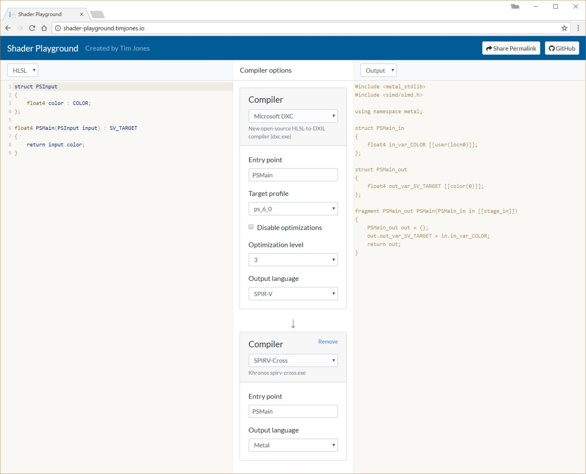

# Shader Playground

Shader Playground is a website for exploring shader compilers.

* [Visit website](http://shader-playground.timjones.io)

## Supported compilers

* [DXC](https://github.com/Microsoft/DirectXShaderCompiler)
* [FXC](https://msdn.microsoft.com/en-us/library/windows/desktop/bb232919(v=vs.85).aspx)
* [Glslang](https://github.com/KhronosGroup/glslang)
* [HLSLcc](https://github.com/Unity-Technologies/HLSLcc)
* [Mali offline compiler](https://developer.arm.com/products/software-development-tools/graphics-development-tools/mali-offline-compiler)
* [Slang](https://github.com/shader-slang/slang)
* [SPIRV-Cross](https://github.com/KhronosGroup/SPIRV-Cross)
* [SPIRV-Cross - Intel fork with ISPC backend](https://github.com/GameTechDev/SPIRV-Cross)
* [SPIRV-Tools](https://github.com/KhronosGroup/SPIRV-Tools)
  * spirv-cfg
* [XShaderCompiler](https://github.com/LukasBanana/XShaderCompiler)

## Contributions

Contributions are gratefully accepted. If you want to add a new compiler, or improve integration with an existing compiler, or any other type of bug fix or improvement to the website, please open an [issue](https://github.com/tgjones/shader-playground/issues).

## Author

[Tim Jones](http://timjones.io)